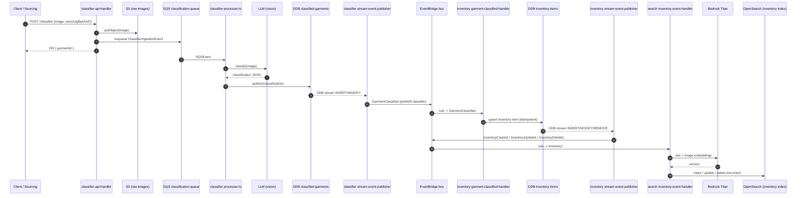
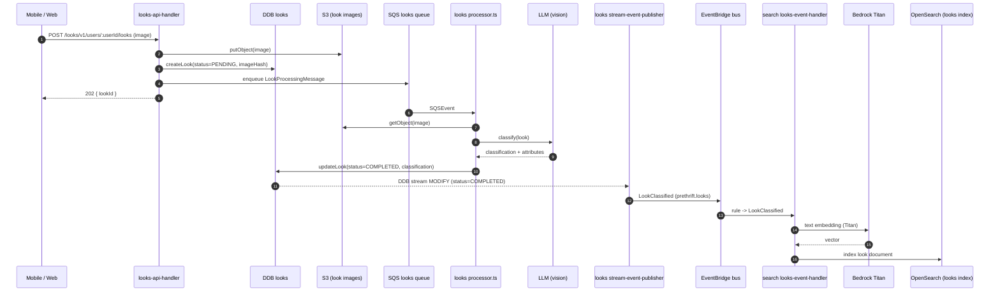
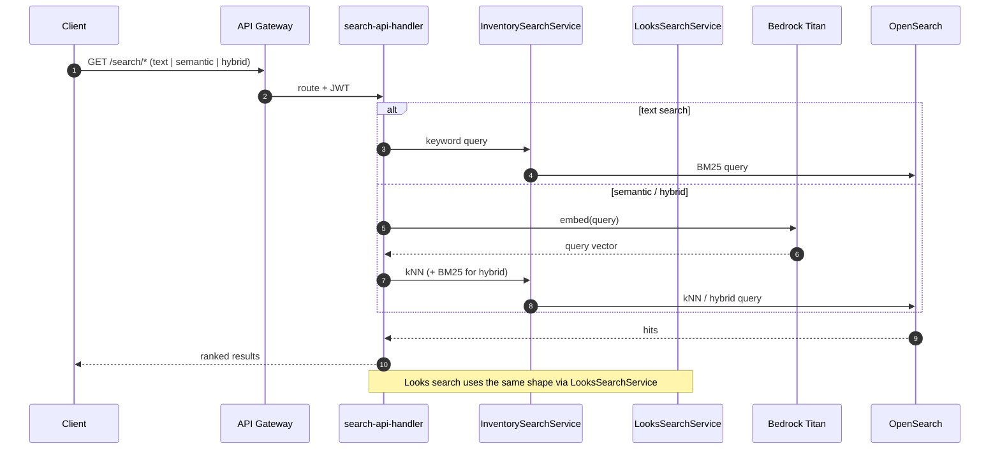
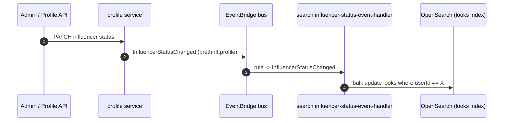
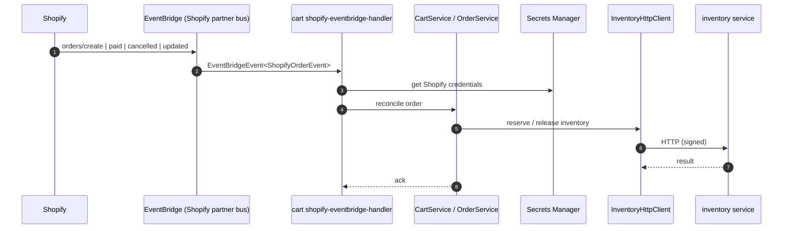

# Prethrift — High-Level Architecture

## Languages & runtime

- **TypeScript** end-to-end (backend + frontend + IaC), strict types, ESM modules.
- **Node.js** on AWS Lambda for the backend.
- **React 19** for the web/mobile UIs.
- Python is not used — fashion/ML logic runs through TS services that call out to managed/LLM APIs.

## Frontend (`../frontend` + `frontend/admin`)

Three frontends, one npm workspace each:

- **`frontend/packages/prethrift-ui`** — main consumer web app. Vite (rolldown-vite build) + React 19. Plain Vite SPA, not Next.
- **`frontend/packages/mobile-app`** — React Native via **Expo SDK 54** with **expo-router**. Auth via **AWS Amplify + amazon-cognito-identity-js**, server state via **TanStack Query**, validation via **Zod**, secure storage via `expo-secure-store`. Web target supported through `react-native-web` so the same app can render in a browser.
- **`backend-issue-146/frontend/admin`** — internal admin app on **Next.js 15** (App Router, Turbopack) with **Tailwind v4**.

Key frontend patterns: typed API clients generated from the backend's OpenAPI specs (`specs/api/*.yaml` → `npm run generate:types`), Cognito-issued JWTs sent to API Gateway, query/cache layer via TanStack Query.

## Backend (`backend-issue-146/`)

A **TypeScript monorepo of Lambda services** built on the **Effect** framework. Top-level npm workspaces are `services/*`, `packages/*`, plus `infra/cdk` and `layers/*`.

### Services (each = its own Lambda set + DynamoDB + EventBridge integrations)

`admin`, `auth`, `cart`, `classifier`, `embedder`, `inventory`, `looks`, `profile`, `reports`, `sandbox`, `search`, `sourcing`, `storefront`.

Per-service layout is rigid (enforced in `CLAUDE.md`):

```text
services/<name>/src/
  handlers/   # thin Lambda entry points
  domain/     # Effect-based business logic (Service + ServiceLive pattern)
  events/     # EventBridge producers/consumers
  schemas/    # Zod schemas + request/response types
  openapi/    # service's OpenAPI contract
  lib/        # internal utilities
test/         # vitest unit/integration/e2e configs
```

Example from `cart`: handlers (`cart-api-handler.ts`, `shopify-eventbridge-handler.ts`) are thin; logic lives in `CartService` / `CartServiceLive`, `OrderService` / `OrderServiceLive`, `ShopifyService` / `ShopifyServiceLive`, `InventoryReservationService` etc. — classic Effect "interface tag + Live layer" pattern with HTTP clients (`InventoryHttpClient`) for cross-service calls.

### Shared packages (`packages/`)

- `effect-utils`, `aws-effects`, `effect-router`, `effect-otel` — Effect runtime, AWS SDK adapters, routing, observability.
- `domain-errors` — tagged error union shared across services.
- `domain-events` — versioned EventBridge payload schemas.
- `event-publisher` — typed EventBridge publishing.
- `api-utils`, `authorization` — request validation, authz helpers.
- `fashion-schema` — canonical garment/ontology types (paired with `specs/garment-ontology.json`).
- `image-utils`, `background-removal`, `llm-utils`, `pipeline-utils` — image + LLM pipeline helpers.
- `organization-utils`, `utils` — misc shared.

### Lambda layers (`layers/`)

`effect`, `effect-otel`, `sharp` (the `sharp` layer is built for `linux-x64-glibc` so Lambda can use the native binary).

### Specs (`specs/`)

`api/*.yaml` (per-service OpenAPI), `ontology/`, `garment-ontology.json`, `price/`. CI checks (`openapi:check`, `api-types:check`) keep TS types and OpenAPI in sync; types are codegen'd via `npm run generate:types`.

## Design patterns

- **Effect-TS as the spine**: `Effect.gen` for sequencing, `Context.Tag` for service interfaces, `Layer.effect` / `Layer.sync` for wiring, tagged domain errors instead of `Error`, `createLambdaRuntime` to host handlers. Handlers are thin transport adapters; all logic is testable Effect programs.
- **Service / ServiceLive split** (interface vs implementation) for DI and easy test doubles.
- **Zod at boundaries**: validate every untrusted input/output; OpenAPI is the source of truth for HTTP shapes.
- **Versioned events** as immutable facts on EventBridge, with separate producer/consumer per service.
- **Adapters between storage / event / domain models** — explicitly forbidden to mix shapes (per `CLAUDE.md`).
- **Single-table DynamoDB only when justified**, otherwise per-service tables; access patterns documented near table definitions.
- **Idempotent async handlers**, conditional writes are deliberate.

## AWS architecture (CDK in `infra/cdk/lib/`)

Per-service stacks composed under one CDK app:

- **API exposure** — `shared-api-gateway-stack.ts` is the front door (HTTP API Gateway), with `api-custom-domain-construct.ts`, `route53-construct.ts`, and `waf-construct.ts` (+ `waf-http-api-association-custom-resource.ts`) for domains, DNS, and WAF.
- **Auth** — `auth-stack.ts` (Cognito user pool / identity).
- **Service stacks** — `cart-stack.ts`, `classifier-stack.ts`, `inventory-stack.ts`, `looks-stack.ts`, `profile-stack.ts`, `search-stack.ts`, `sourcing-stack.ts`, `storefront-stack.ts`, `admin-stack.ts`. Each owns its Lambdas, DynamoDB tables, S3 buckets, IAM, and any service-specific resources.
- **Eventing** — `eventbridge-stack.ts` + `eventbridge-rules-stack.ts` (custom bus + rules wiring producers to consumers).
- **Search** — `opensearch-construct.ts` (managed OpenSearch for catalog/search service).
- **Analytics** — `infra/athena/` and `athena-query-construct.ts` for S3 + Athena query workloads, plus `batch-processing-stack.ts` / `batch-processing-table.ts` for batch pipelines.
- **Image hosting** — `branded-image-domain-construct.ts` (CloudFront-fronted image domain).
- **Cost / governance** — `cost-monitoring-stack.ts`, `nag-suppressions.ts` (cdk-nag), `domain-redirect-stack.ts`.
- **Layers** — `effect-otel-layer.ts` etc. mount the Lambda layers built in `layers/`.

Storage and integration: **DynamoDB** (per-service), **S3** (images, exports), **EventBridge** (cross-service async), **OpenSearch** (catalog search), **Cognito** (auth), **CloudFront** + Route53 + WAF (edge), **Athena** (analytics over S3), **Secrets Manager** (e.g. Shopify keys in cart). Other infra dirs: `infra/terraform/` (a slice of infra that's still TF), `infra/dns-migration/`.

## Tooling, testing, ops

- **Vitest** with three configs per service (`unit`, `integration`, `e2e`) plus root-level `vitest.config.{integration,e2e}.ts` and a workspace.
- **ESLint + Prettier + markdownlint + syncpack** at the root; **husky + lint-staged** for pre-commit; `scripts/ci/` holds pre-push / changed-file validation.
- **OpenTelemetry** via `@prethrift/effect-otel` package and the `effect-otel` Lambda layer; AWS Powertools optional.
- **Operational scripts** in `scripts/` (batch ingest, baseline capture, classifier experiments, OpenSearch reindex, inventory backfill, Wix import, etc.) — run via `tsx`.
- **CDK deploys** orchestrated by `scripts/operational/deploy-service.sh`; targeted commands like `deploy:auth-api`, `deploy:eventbridge`, `synth`.

## Cross-cutting rules (from `CLAUDE.md`)

Strict service boundaries (no cross-service DB reads), shared contracts only in shared packages, public API == OpenAPI, versioned events, idempotent replays, least-privilege IAM, explicit retries/DLQs, no AWS SDK types leaking into domain layers, no `any`. Tests must verify behavior, not just execution.

---

## Workflows

The async pipelines are wired through three primitives: **SQS** (work queues feeding LLM-heavy processors), **DynamoDB Streams** (turn writes into events without coupling producers to consumers), and **EventBridge** (the cross-service fan-out bus). Embeddings for OpenSearch indexing are generated inline in the search-side consumers via **AWS Bedrock Titan** (`amazon.titan-embed-text-v2:0`) — the standalone `services/embedder` is only a local stub server.

### 1. Garment classification → Inventory → Search index

End-to-end ingestion of a single garment image (or a sourcing batch).



Idempotency hooks: classifier processor uses `IDEMPOTENCY_TABLE_NAME`; inventory consumer is keyed by `garmentId`; search indexer is keyed by inventory item id.

### 2. Looks upload → Looks classification → Search index

Looks have their own ingress (consumer-uploaded outfit photos), but the back half mirrors the garment pipeline.



Duplicate-upload guard: `looks-api-handler` hashes the image (`sha256`) per user and short-circuits unless `forceReprocess=true`.

### 3. Search at query time



### 4. Influencer status change → bulk re-rank looks

Profile owns the influencer flag; search owns the index.



### 5. Shopify order → Cart → Inventory reservation

Cart consumes Shopify order events delivered through Amazon EventBridge's Shopify partner integration, then reaches Inventory over HTTP for reservation/availability — the only sanctioned cross-service synchronous call in this pipeline.



Non-Prethrift Shopify webhooks are skipped instead of crashing (recent fix on `backend-issue-146`).

### 6. StyleRoom (profile) → Looks subscriber

Profile emits `StyleRoomCreated/Updated/Deleted` (source `profile.styleroom`); looks owns a dedicated subscriber (`looks/handlers/styleroom-subscriber.ts`) that reacts to those changes for downstream UX.

### Cross-cutting workflow guarantees

- **Versioned events** (`@prethrift/domain-events`) — payloads carry `eventType` + version; consumers pattern-match on tagged unions.
- **Idempotency** — `IDEMPOTENCY_TABLE_NAME` is wired through the heavy processors; DDB-stream-driven consumers key on stable item ids.
- **Decoupling via DDB streams** — producers (classifier, inventory, looks) never publish events directly from API handlers; the stream publisher is a separate Lambda. This keeps the write path fast and gives EventBridge a single, replayable source of truth.
- **Embeddings live with the indexer** — the search service owns Bedrock calls so each consumer can independently choose model + dimensions without coupling producers to the embedding stack.
- **Failure/replay** — DLQs on SQS + EventBridge rules; consumers must be idempotent; `forceReprocess` query flag exists on the looks API for manual replays.
